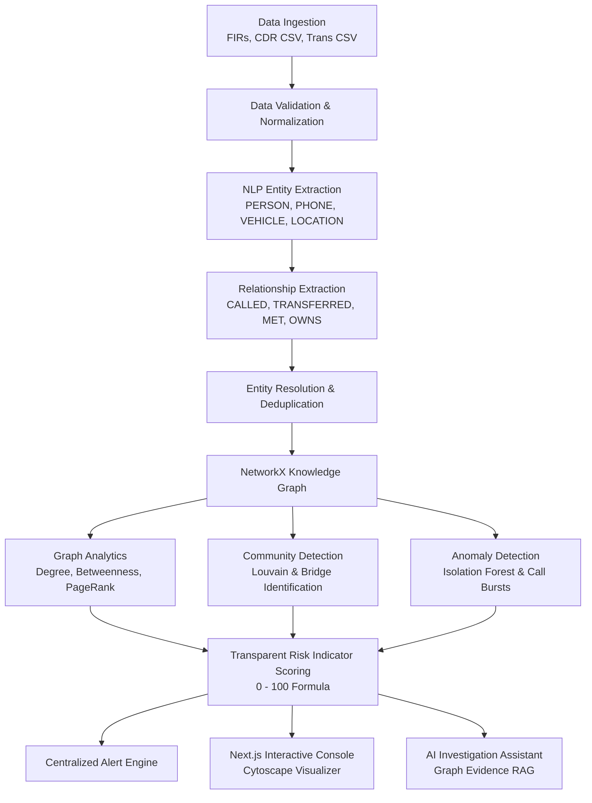

# NEXUS — AI-Powered Criminal Network Analysis & Investigation Intelligence System


NEXUS is a full-stack, AI-powered criminal network analysis and investigation intelligence system. It analyzes fragmented crime and intelligence data (police FIR texts, CDR call records, financial ledgers, vehicle registries, surveillance logs) to uncover hidden relationships, network structures, influential individuals, intermediary bridge nodes, suspicious communications, and anomalous financial activity.

---

## System Architecture Pipeline



---

## Key Features

1. **Multi-Modal Data Ingestion**:
   - Ingests raw FIR text (`.txt`, `.pdf`, `.docx`), CDR call detail CSVs, and banking transaction CSVs into a unified knowledge graph.
2. **Hybrid NLP Entity & Relationship Extraction**:
   - Rule-based regex + spaCy NER patterns recognizing Indian vehicle registrations (`DL01AB1234`), 10-digit phones (`9876543210`), bank accounts, and locations.
3. **Interactive Cytoscape.js Knowledge Graph**:
   - Color and shape differentiation per entity type (PERSON = Circle, PHONE = Diamond, VEHICLE = Rectangle, LOCATION = Hexagon, BANK_ACCOUNT = Tag).
   - Zoom, Pan, Shortest Path tracing, Neighborhood ego expansion, and Community cluster coloring.
4. **Graph Analytics & Bridge Node Identification**:
   - Degree Centrality (connectedness), Betweenness Centrality (identifies intermediaries like **Amit Verma** bridging separate communities), PageRank (influence).
5. **Machine Learning Anomaly Detection**:
   - **Isolation Forest** & statistical thresholding on financial transfers.
   - Frequency burst and night-time call detection on CDR logs.
6. **Transparent Weighted Risk Scoring (0–100)**:
   - `0.20 * comm_anomaly + 0.20 * tx_anomaly + 0.20 * centrality + 0.15 * intermediary + 0.15 * assoc + 0.10 * location`
   - Strict investigative indicator language (no definitive legal verdicts).
7. **AI Investigation Assistant with Evidence Citations**:
   - Answers questions like *"How is Rohit Sharma connected to Sameer Khan?"*, *"Who connects the two largest communities?"*, and *"Show unusual transactions"*, backed directly by graph evidence with zero hallucinations.
   - Dual-engine: Works 100% offline with local deterministic RAG, with optional OpenAI/Gemini augmentation.

---

## Tech Stack

- **Frontend**: Next.js 14, TypeScript, React 18, Tailwind CSS, Cytoscape.js, Recharts, TanStack Query, Lucide Icons.
- **Backend**: Python 3.11+, FastAPI, SQLAlchemy, SQLite (zero-config local) / PostgreSQL (production/docker), NetworkX, Scikit-learn (Isolation Forest), Pandas, NumPy, Pydantic v2.
- **AI/NLP**: Local deterministic graph traversal RAG + rule-based NLP + optional external LLM abstraction.

---

## Quick Start (Local Setup)

### 1. Prerequisites
- Python 3.11+
- Node.js 18+ and npm

### 2. Backend Setup
```bash
# Navigate to backend and create virtual environment
cd backend
python -m venv .venv

# Activate venv:
# Windows (PowerShell):
.venv\Scripts\Activate.ps1
# Linux / macOS:
source .venv/bin/activate

# Install dependencies
pip install -r requirements.txt

# Seed the demo dataset ("Operation Nexus")
python ../scripts/seed_demo.py

# Start FastAPI server
uvicorn app.main:app --reload --port 8000
```

Backend API will be running at `http://localhost:8000`.
Interactive Swagger Docs: `http://localhost:8000/docs`.

### 3. Frontend Setup
```bash
# Open a new terminal and navigate to frontend
cd frontend

# Install packages
npm install

# Start Next.js development server
npm run dev
```

Frontend application will be accessible at `http://localhost:3000`.

---

## Docker Setup

To run the entire system (PostgreSQL + FastAPI Backend + Next.js Frontend) in Docker:

```bash
docker compose up --build
```

---

## Demonstration Workflow (SIH Presentation Flow)

1. **Enter Investigation Console**: Open `http://localhost:3000` to view the **Operation Nexus** dashboard showing 96 entities, 250 relationships, detected anomalies, and analytical charts.
2. **Network Explorer**: Navigate to **Network Explorer** to view the Cytoscape graph.
3. **Inspect Key Lead**: Click on **Rohit Sharma**; the Entity Intelligence drawer opens showing risk score (70/100), betweenness metrics, associated phone `9876543210`, shared vehicle `DL01AB1234`, and key measurable indicators.
4. **Identify Bridge Node**: Notice **Amit Verma** acting as a high-betweenness connector between Community 1 (Northern cluster) and Community 2 (Western cluster).
5. **Shortest Path Analysis**: Click **Shortest Path**, select Source: *Rohit Sharma* and Target: *Sameer Khan*. The path highlights the exact intermediary hops with evidence.
6. **Inspect Anomalies**: Open **Alerts & Anomalies** to review the ₹8,50,000 Hawala transfer and CDR communication bursts.
7. **Ask AI Copilot**: Open **AI Assistant** and ask:
   - *"How is Rohit Sharma connected to Sameer Khan?"*
   - *"Which person connects the two largest communities?"*
   - *"Show unusual transactions."*
8. **Live Document Ingestion**: Navigate to **Data Sources**, upload sample FIR `data/demo/fir_reports/fir_1023.txt`, and observe live entity and relationship extraction integrating into the knowledge graph.

---

## Privacy and Investigative Ethics Notice

> [!IMPORTANT]
> This prototype uses synthetic data for demonstration. AI-generated outputs are **investigative leads** and must be verified against source evidence. The system does not determine guilt or criminality.
